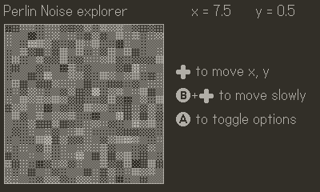
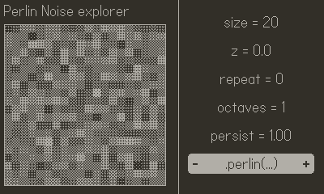

# Perlin Explorer

This game for the [Playdate](https://play.date) explores the [Perlin noise API](https://sdk.play.date/1.9.3/Inside%20Playdate.html#_perlin_noise) provided by the [Playdate SDK](https://play.date/dev/#cardSDK)

## About
This was built as I was trying to understand the API with help from folks in [the Playdate Dev Forum](https://devforum.play.date/t/how-to-make-perlin-noise-return-something-other-than-0-5/4200). It does the following:

1. Generates a `size` x `size` grid of Perlin noise (values from 0.0 - 1.0)
2. Dithers them to get a color pattern somehwere between black and white
3. Draws those squares in the grid.

### Options

Using the options screen, you can change
- the number of squares in the grid (`size`)
- the `z` value (these values are in 3D-space, turns out.)
- how often the pattern repeats
- the number of "octaves" to use, and how much to persist later octaves.
- the method by which the noise is generated

## License

This is licensed under the MIT License. See [LICENSE.md](LICENSE.md) for more
details. Generally: anything you build with this is yours.

This template only works with the Playdate SDK. Make sure you follow the terms
of the [Playdate SDK License](https://play.date/dev/sdk-license) when building
your games.
